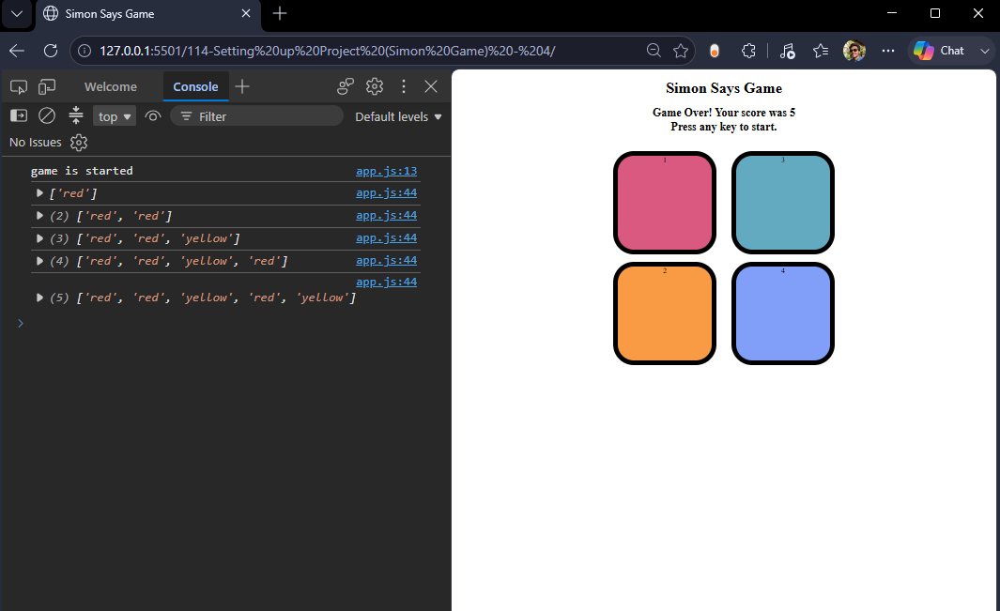

# 🎮 Simon Says Game

A simple and interactive **Simon Says Game** built using **HTML, CSS, and JavaScript**.

The game generates a random sequence of colors, and the player has to remember and repeat the sequence correctly. With every successful round, the sequence becomes longer and the difficulty increases.

## 🚀 Live Preview

Open the `index.html` file in your browser to play the game.

## 📌 Features

- 🎯 Random color sequence generation
- 🧠 Tests the player's memory
- 📈 Level increases after every correct sequence
- ✨ Button flash animation
- 🖱️ Mouse click interaction
- 💥 Game Over when the sequence is incorrect
- 🔄 Game can be restarted by pressing any key

## 🛠️ Technologies Used

- **HTML5** – Structure of the game
- **CSS3** – Styling and animations
- **JavaScript** – Game logic and user interaction

## 📂 Project Structure

    Simon-Says-Game/
    │
    ├── index.html
    ├── style.css
    ├── app.js
    ├── screenshot.png
    └── README.md

## 🎮 How to Play

1. Open the game in your browser.
2. Press any key to start the game.
3. Watch the button that flashes.
4. Click the button that flashed.
5. In the next level, remember the previous sequence and click the buttons in the correct order.
6. Continue playing as long as you remember the sequence correctly.
7. If you click the wrong button, the game is over.
8. Press any key to start a new game.

## 🧩 Game Logic

The game maintains two arrays:

    let gameSeq = [];
    let userSeq = [];

- `gameSeq` stores the sequence generated by the game.
- `userSeq` stores the sequence clicked by the player.

Whenever the player clicks a button, the selected color is added to `userSeq` and compared with `gameSeq`.

If the complete sequence is correct, the game moves to the next level.

If the player clicks the wrong button, the game ends and the score is displayed.

## 🎨 Colors

The game contains four buttons:

| Button | Color |
|--------|-------|
| 🔴 | Red |
| 🟠 | Yellow |
| 🟣 | Purple |
| 🔵 | Green |

## 📸 Game Preview

<<<<<<< HEAD
<<<<<<< HEAD

=======

>>>>>>> 9643611 (added code)
=======

>>>>>>> c61ba20 (update README.md)

The game provides a simple **2×2 button layout**, where each button represents a different color.

## 💻 Installation & Setup

No additional dependencies are required.

### Step 1: Clone the Repository

    git clone <your-repository-url>

### Step 2: Open the Project

Navigate to the project folder:

    cd Simon-Says-Game

### Step 3: Run the Game

Open `index.html` in any modern web browser.

## 👨‍💻 Author

**Gangittla Hari Prasad**

Made with ❤️ using **HTML, CSS & JavaScript**.

⭐ If you like this project, consider giving it a star!
